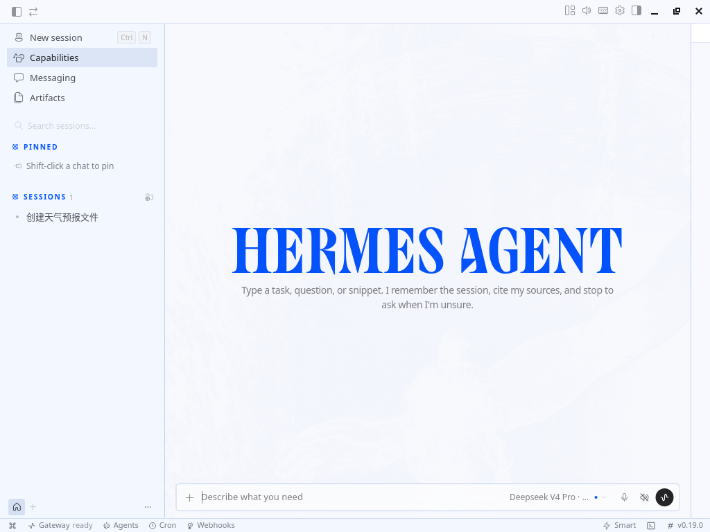
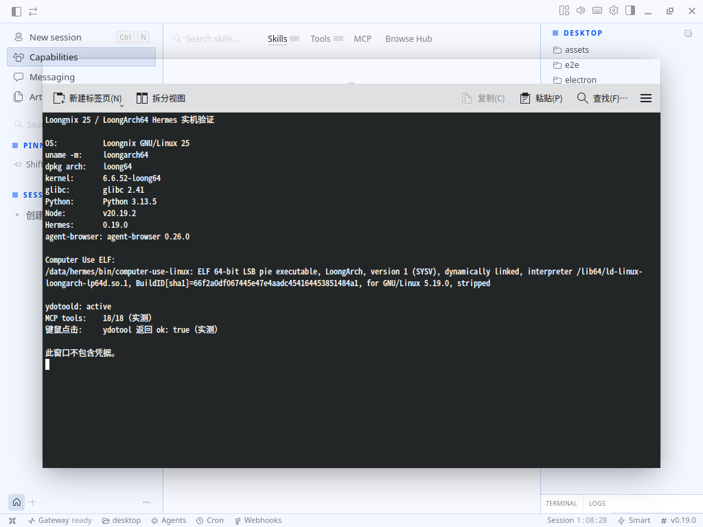

# 龙芯 Loongnix 25 部署 Hermes Agent：CLI、浏览器、Computer Use 与 Electron Desktop 实测

> 本文来自一块真实 LoongArch64 板卡的部署记录，验证日期为 2026-07-26。
> 为便于复现，我把操作拆成多个职责单一、可重复执行的脚本。所有密钥都由使用者在本机输入，示例和截图中不包含凭据。

## 一、先说结论

Hermes Agent 并没有一个“LoongArch 安装包”，官方快捷安装器依赖的部分预编译工具也没有 LoongArch 版本，但这不等于 Hermes 不能运行。

本次实测已经完成：

1. Hermes 0.19.0 核心从源码安装；
2. DeepSeek API 对话以及 Agent 调用终端工具；
3. 复用 Loongnix 预装 LBrowser（Chromium 138）进行本地浏览器自动化；
4. 原生编译 `agent-browser` 0.26.0；
5. 构建 Hermes Dashboard；
6. 编译并注册 `computer-use-linux` MCP，发现 18/18 个工具；
7. 聚焦 Hermes 窗口，并通过 `ydotool` 完成一次真实鼠标点击；
8. 使用龙芯 Electron 31.7.7 启动 Hermes Desktop 开发版。

不能混为一谈的结论是：

- Hermes 核心已经可用；
- 浏览器自动化已经可用；
- Computer Use 的窗口聚焦、截图链路和鼠标点击已经打通；
- Electron Desktop 是开发版启动，不是可分发的正式安装包；
- 录音和本地语音识别尚不应标记为可用。

项目地址：

- [NousResearch/hermes-agent](https://github.com/NousResearch/hermes-agent)
- [vercel-labs/agent-browser](https://github.com/vercel-labs/agent-browser)
- [agent-sh/computer-use-linux](https://github.com/agent-sh/computer-use-linux)
- [ydotool](https://github.com/ReimuNotMoe/ydotool)
- [龙芯 Electron 下载页](https://docs.loongnix.cn/electron/download/index.html)

## 二、测试环境

| 项目 | 实测值 |
|---|---|
| 操作系统 | Loongnix GNU/Linux 25 |
| 内核 | `6.6.52-loong64` |
| `uname -m` | `loongarch64` |
| `dpkg --print-architecture` | `loong64` |
| glibc | 2.41 |
| Python | 3.13.5 |
| GCC | 14.2 |
| Node.js / npm | 20.19.2 / 9.2.0 |
| Hermes | 0.19.0，commit `07e97d2f5dc3d2092cfe693ef07b2527a36cd2d8` |
| agent-browser | 0.26.0 |
| computer-use-linux | 0.4.2，commit `8cc1fafb78d9df047ca89a1974735c1a2bbc5060` |
| Electron | 龙芯原生 31.7.7 |

### `loong64` 还是 `loongarch64`

两者都没有写错：

- Loongnix/Debian 软件包架构名是 `loong64`；
- Linux、GCC、Python 常见机器名是 `loongarch64`；
- Rust target 是 `loongarch64-unknown-linux-gnu`；
- Node.js 在该系统上使用 `loong64`，原生模块目录也会出现 `linux-loong64-*`。

脚本不能把这些字符串机械地统一成一个名字，必须按各工具实际接受的名称传参。

## 三、部署包的设计

完整目录如下：

```text
loongnix25-hermes-kit/
├── config/
│   └── deploy.env.example
├── scripts/
│   ├── lib/common.sh
│   ├── 00-preflight.sh
│   ├── 10-install-system-deps.sh
│   ├── 20-install-hermes-core.sh
│   ├── 30-configure-deepseek.sh
│   ├── 40-install-browser.sh
│   ├── 50-build-dashboard.sh
│   ├── 60-install-computer-use.sh
│   ├── 61-install-ydotool.sh
│   ├── 70-prepare-electron31-dev.sh
│   ├── 71-run-electron31-dev.sh
│   └── 90-verify.sh
└── images/
```

这里有几个刻意的设计：

- 不自动分区、格式化或合并磁盘；
- 默认把源码、虚拟环境、Rust/Node/Python 缓存放进 `/data/hermes`；
- Electron 单独放在 `/data/work`，避免污染 Hermes 核心源码；
- 需要改系统软件包的阶段才使用管理员权限；
- 密钥不写进仓库、日志或命令行参数；
- 每个阶段失败即停止，源码有未提交修改时拒绝切换版本；
- 在内存较小的板卡上把原生构建并行度限制为 1。

先准备一个属于当前用户、空间足够的目录。建议核心至少预留 8 GiB；若还构建浏览器、Dashboard、Computer Use 和 Electron 开发版，建议准备 15～25 GiB。

复制配置：

```bash
cd loongnix25-hermes-kit
cp config/deploy.env.example config/deploy.env
```

默认配置：

```bash
HERMES_BASE=/data/hermes
WORK_BASE=/data/work
BUILD_JOBS=1
```

目录不存在时先创建并把所有权交给普通桌面用户。不要让整个 Hermes 构建过程以 root 身份运行。

## 四、运行预检

```bash
bash scripts/00-preflight.sh
```

该脚本只读检查：

- 系统和两套架构名称；
- glibc、内核；
- 数据目录所在文件系统及剩余空间；
- 内存和 swap；
- LBrowser 是否位于预期路径。

2 GiB 左右内存的板卡必须有足够 swap。否则 Rust、Python 原生扩展和 Vite 构建可能被 OOM Killer 终止。

## 五、安装系统依赖

```bash
sudo bash scripts/10-install-system-deps.sh
```

主要依赖分为四类：

1. Python：`python3-venv`、`python3-dev`；
2. C/C++：GCC、CMake、OpenSSL、libffi、图片库；
3. Rust：先装系统 `rustc/cargo` 作为引导；
4. Node：Loongnix 仓库的 Node.js 和 npm。

Loongnix 仓库提供的是 `loong64` DEB 包，不需要拿 x86_64 包硬装。

## 六、安装 Hermes 核心

```bash
bash scripts/20-install-hermes-core.sh
```

脚本做了以下事情：

1. 在 `/data/hermes` 创建隔离的源码、虚拟环境、缓存和日志目录；
2. 安装 Rust 官方 stable 的 `loongarch64-unknown-linux-gnu` 工具链；
3. 校验并预载 Pillow 12.2.0 源码包；
4. 固定 Hermes 源码到实测 commit；
5. 创建 Python venv；
6. 从源码构建缺少 LoongArch wheel 的 Python/Rust 扩展；
7. 创建 `~/.local/bin/hermes` 包装命令。

### 为什么不用官方一键安装器

官方安装流程中的 `uv` 等托管二进制未覆盖 LoongArch。本次采用系统 Python + 独立 venv，并让原生依赖在板卡上编译。

### 为什么另装新 Rust

系统 Rust 1.85 可以作为引导工具链，但 Hermes 依赖树中的新版 Maturin 要求更高的 MSRV。脚本把新 Rust 放到 `/data/hermes/toolchains`，不替换系统 Rust。

### 为什么预载 Pillow

板卡下载大源码包时发生过低速和中断。脚本固定 Pillow 12.2.0 源码地址及 SHA-256：

```text
a830b1a40919539d07806aa58e1b114df53ddd43213d9c8b75847eee6c0182b5
```

缓存命中后不会重复下载或构建。

## 七、配置模型

```bash
bash scripts/30-configure-deepseek.sh
```

脚本会静默读取 API Key，把它写入权限为 `0600` 的 Hermes 私有环境文件，并设置：

```text
provider: deepseek
model: deepseek-v4-pro
```

如果账户实际可用的模型名不同：

```bash
DEEPSEEK_MODEL=你的模型名 bash scripts/30-configure-deepseek.sh
```

`deepseek-v4-pro` 是本次账户中实际验证过的 API 模型名，不代表每个 API 账户在任何时间都一定拥有相同的模型目录。

## 八、复用龙芯浏览器

```bash
bash scripts/40-install-browser.sh
```

Hermes 的本地浏览器工具依赖 `agent-browser`。上游发行版没有 LoongArch 预编译 CLI，因此脚本固定 v0.26.0 并从 Rust 源码编译。

浏览器本体不下载 Playwright Chromium，而是复用 Loongnix 预装的：

```text
/opt/apps/lbrowser/lbrowser
```

实测 LBrowser：

- 软件包版本 3.4.2082.1；
- Chromium 138.0.7204.303；
- CDP 1.3；
- 能完成页面导航、可访问性快照、文本输入、按钮点击和 PNG 截图；
- Agent 经 DeepSeek 调用浏览器工具的完整链路通过。

持久配置为：

```text
browser.cloud_provider=local
browser.engine=chrome
browser.headed=false
AGENT_BROWSER_EXECUTABLE_PATH=/opt/apps/lbrowser/lbrowser
```

## 九、构建 Dashboard

Dashboard 是可选项：

```bash
bash scripts/50-build-dashboard.sh
```

Vite 8 的三个原生前端组件在官方 npm optional dependencies 中没有 LoongArch 项。脚本先按官方 lockfile 安装通用包，再从 Loongnix npm 仓库注入完全匹配的原生绑定：

```text
@rolldown/binding-linux-loong64-gnu 1.1.3
lightningcss-linux-loong64-gnu 1.32.0
@tailwindcss/oxide-linux-loong64-gnu 4.3.1
```

构建完成后创建用户级 `hermes-dashboard.service`，只监听：

```text
127.0.0.1:9119
```

如果需要在没有交互登录时保持用户服务：

```bash
sudo loginctl enable-linger "$(id -un)"
```

## 十、安装 Computer Use

先执行：

```bash
bash scripts/60-install-computer-use.sh
```

该脚本固定 `computer-use-linux` 源码 commit，在龙芯板卡上原生构建，并注册为 Hermes stdio MCP。

实测两个产物都是 LoongArch ELF：

```text
c260d30565e1852c132124af88003298648e3ef9b2fc3c5d4614450c9ad8c745  computer-use-linux
c4752d743b7578032dc4c82bed079631e63ffc3ca9420a32279d4ce7c40156d3  computer-use-linux-cosmic
```

不同编译环境可能产生不同 Build ID，因此复现时应比较同一次构建传输前后的哈希，而不是强行要求与上面的样本完全相同。

### 真正容易卡住的是 Python MCP 依赖

Hermes 0.19.0 使用：

```text
mcp==1.26.0
starlette==1.0.1
```

依赖链中的 `rpds-py` 没有 LoongArch wheel，最新版 Maturin 又超出系统 Rust 的 MSRV。脚本先固定 Maturin 1.9.6，再以 `--no-build-isolation` 原生构建：

```text
rpds-py==0.25.1
```

最后执行 `pip check`，避免“命令能启动但依赖已经冲突”。

## 十一、Computer Use 为什么还需要 ydotool

仅仅看到 `doctor` 的 blockers 为 0，不能证明真实点击一定可用。

第一次实测调用 `click` 时得到：

```text
failed to run ydotool: No such file or directory
```

安装 `xdotool` 也没有改变结果，因为 `computer-use-linux` 0.4.2 的这个输入路径明确调用的是 `ydotool`。

执行：

```bash
bash scripts/61-install-ydotool.sh
```

脚本固定 ydotool v1.0.4，并校验源码包：

```text
ba075a43aa6ead51940e892ecffa4d0b8b40c241e4e2bc4bd9bd26b61fde23bd
```

它原生构建 `ydotool` 和 `ydotoold`，然后创建持久 systemd 服务。`ydotoold` 需要访问 `/dev/uinput`，因此是一个高权限输入组件。脚本把 Unix Socket 设为 `0600`，仅归目标桌面用户所有，不应放宽权限。

补齐后，对 Hermes 窗口执行相对坐标点击，MCP 返回：

```json
{
  "action": "click",
  "implemented": true,
  "message": "Action sent through ydotool.",
  "ok": true
}
```

这时才能准确地说“鼠标输入链路已经打通”。

## 十二、Electron 31.7.7 开发版

此阶段是实验性的：

```bash
bash scripts/70-prepare-electron31-dev.sh
bash scripts/71-run-electron31-dev.sh
```

Hermes 当前源码要求 Electron 40.10.2，但龙芯公开下载页提供的实测版本是 31.7.7。脚本在单独工作树中把 Desktop 依赖降到 31.7.7，然后使用龙芯官方 ZIP：

```text
electron-v31.7.7-linux-loong64.zip
SHA-256:
ad4ba5f41931142e2716b7dc1eb0a67330ec12a49dec0d3ed51d1e58b3da117e
```

下载地址：

[electron-v31.7.7-linux-loong64.zip](https://github.com/loongson/electron/releases/download/v31.7.7/electron-v31.7.7-linux-loong64.zip)

实际遇到的兼容点有：

1. npm 安装必须使用 `--ignore-scripts`，否则 Windows 打包依赖会寻找不存在的 `7z-loong64.exe`；
2. Electron ZIP 要手动放进 npm `electron` 包的 `dist`；
3. `path.txt` 必须是 8 字节的 `electron`，不能带换行；
4. Rolldown、LightningCSS、Tailwind Oxide 要注入 Loongnix 原生绑定；
5. 镜像中的 Shiki 包不完整，使用官方 Shiki 4.3.1 替换；
6. `node-pty` 必须针对 Electron 31 的 ABI 125 重建，产物目录是 `linux-loong64-125`。

最终已完成 `npm run build` 和 `npm run dev`，Hermes Desktop 能显示主界面。



这仍然不代表 `electron-builder` 已经能生成 AppImage/DEB/RPM。当前结论只覆盖开发版启动。

## 十三、实机验证截图

下面的终端窗口来自板卡本地图形会话，没有显示凭据。它同时展示了两套架构名、Hermes/agent-browser 版本、Computer Use ELF、ydotoold 状态和真实点击结果。



Hermes Desktop 的能力导航可以打开，但本次开发版有一次连接后端 15 秒超时。因此没有把“能力页能显示”作为功能成功证据，判断以命令行检查、MCP 返回值和端到端工具调用为准。

## 十四、运行总验证

```bash
bash scripts/90-verify.sh
```

它会检查：

- Hermes 版本、源码 commit 和 Python 依赖；
- 配置文件权限；
- LBrowser 与原生 agent-browser；
- Dashboard 服务和状态 API；
- Computer Use ELF 与 MCP 握手；
- ydotoold Socket 所有权。

为了避免误操作，验证脚本不会自动发起模型付费请求，也不会主动点击当前桌面。需要验证模型和 GUI 动作时，应在无敏感内容的测试会话中单独进行。

## 十五、Loongnix 25 上的能力边界

| 功能 | 当前状态 | 影响范围与判断 |
|---|---|---|
| Hermes CLI、记忆、终端/文件工具 | 可用 | 核心 Agent 工作不受影响 |
| DeepSeek API 对话与工具调用 | 可用 | 使用云模型，不依赖本地推理框架 |
| 本地浏览器自动化 | 可用 | LBrowser + agent-browser 已完成页面、输入、点击、截图测试 |
| Dashboard | 可用 | 原生绑定需手工注入，建议仅监听回环地址 |
| MCP 扩展 | 可用 | Python SDK 的 `rpds-py` 需 LoongArch 原生构建 |
| Computer Use 窗口聚焦 | 可用 | KWin 精确找到并聚焦 Hermes 窗口 |
| Computer Use 截图 | 基础链路可用 | 桌面截图已获取；Portal/权限在不同桌面会话中仍可能需要处理 |
| Computer Use 鼠标点击 | 可用 | 必须运行 ydotoold；已得到真实 `ok: true` |
| Computer Use 键盘输入 | 基础快捷键可用 | `Ctrl+N` 经 X11 XTEST 实际切换到 Hermes 新会话；没有 AT-SPI 焦点的应用仍可能收到“按键落点不确定”警告 |
| 老式 X11/Motif 应用的控件识别 | 有限 | 例如扫雷程序可能没有 AT-SPI 控件树，只能依赖截图与坐标/视觉 |
| Hermes Desktop | 实验可用 | Electron 31.7.7 开发版可启动；正式打包未完成 |
| Desktop 能力页 | 偶发超时 | 不影响 CLI 核心，但说明开发版前后端连接仍需继续加固 |
| 麦克风录音 | 暂不建议使用 | 声卡能枚举，但实际采集测试曾触发系统 soft lockup，归因尚未完成 |
| 本地语音识别 | 不可用 | `faster-whisper`、CTranslate2/Whisper/Torch 未安装，DeepSeek 对话 API也不等于 STT |
| Ollama 本地模型 | 未纳入 | 用途是离线/私有推理；能否实用取决于 LoongArch runner、模型量化和板卡内存 |
| Telegram、Discord、Docker | 未安装 | 属于可选集成，不是 Hermes 核心的架构阻塞 |

### 哪些问题值得继续攻关

优先级最高的是：

1. Electron 31 与 Hermes 新版前端/主进程 API 的长期兼容；
2. `electron-builder` 的 LoongArch 打包链；
3. Computer Use 对没有可访问性树的传统 X11 应用进行视觉定位；
4. 录音 soft lockup 的内核、音频驱动和 Electron 渲染进程归因。

如果目标只是让 Hermes 在龙芯上完成代码、文件、命令、网页任务，那么前三个可选阶段都不是上线阻塞。若目标是做“像人一样操作整个桌面”的 Agent，Computer Use 的安全权限、视觉定位和应用兼容才是主要工作量。

## 十六、常见错误

### 1. `uv` 没有 LoongArch 二进制

不要反复运行一键安装器，改用 venv + pip 源码构建。

### 2. Maturin 报 Rust 版本过低

保留系统 Rust，用独立目录安装新 stable，不要强行替换系统包。

### 3. Vite 找不到 `linux-loong64-gnu`

版本必须与 JavaScript 包精确匹配，不能混用 Rolldown/LightningCSS/Oxide 的其他版本。

### 4. `computer-use-linux doctor` 通过但点击失败

直接执行一次可控点击测试并检查错误。若提示找不到 ydotool，运行 61 阶段；安装 xdotool 不能代替它。

### 5. Electron npm 安装查找 `7z-loong64.exe`

这是打包依赖的安装脚本假设，不是 Electron 运行时本身缺失。开发版先用 `npm ci --ignore-scripts`，再手动安装龙芯 Electron ZIP。

### 6. 构建突然退出

先检查：

```bash
free -h
df -hT /data/hermes /data/work
journalctl -k -b | grep -Ei 'oom|killed process|soft lockup'
```

原生构建默认保持单任务，避免同时启动多个 Cargo/npm 编译。

## 十七、最终评价

LoongArch 上部署 Hermes 的真正门槛，不是 Python 代码本身，而是上游发布体系通常只提供 x86_64 和 AArch64 二进制。处理方法可以归纳为三类：

1. 纯 Python 部分放进隔离 venv；
2. Rust/C/C++ 扩展在 LoongArch 上原生构建；
3. Node/Electron 原生模块从 Loongnix 仓库注入，或针对目标 ABI 重建。

在本次环境中，Hermes 已经越过“能不能启动”的阶段，进入“核心 Agent、浏览器、MCP 和基础桌面输入都能实际工作”的阶段。剩余问题主要集中在 Electron 正式发行、传统桌面应用的视觉控制以及音频稳定性，而不是 Hermes 核心不可用。

建议标签：

```text
龙芯 LoongArch Loongnix Hermes Agent AI Agent MCP Electron Rust 国产CPU
```
